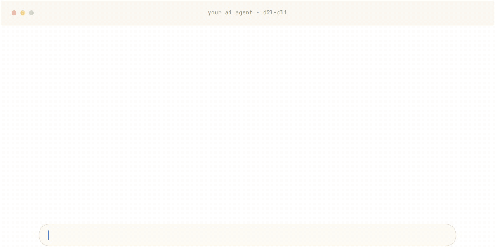
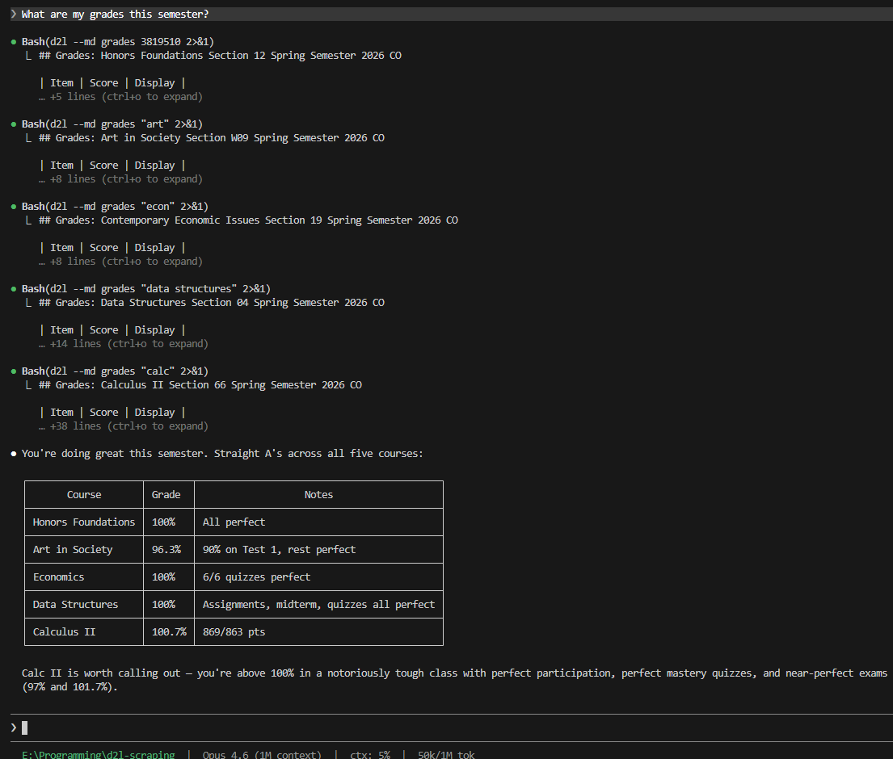
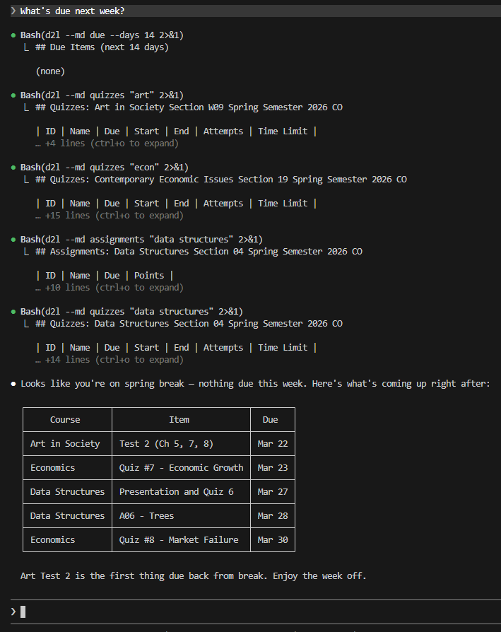

<p align="center">
  
</p>

<p align="center">
  
  
  
  
</p>

**d2l-cli** gives any AI agent — Claude Code, OpenClaw, Cursor, Copilot, Gemini CLI, anything that can run a command — read-only access to your D2L Brightspace courses. Grades, due dates, assignments, quizzes, syllabi, announcements, lecture files. You stop clicking through D2L and start asking questions.

Works at **any school on Brightspace**. Kennesaw State and Georgia State are one-word presets.

## Set up in one message

Paste this into your AI agent:

```text
Fetch and follow the instructions from
https://raw.githubusercontent.com/Aaryan-Kapoor/d2l-cli/main/INSTALL_FOR_AGENTS.md
Set up d2l-cli for me end to end. You should only need me twice: to tell you
my school, and to log in when a browser window opens.
```

That's the whole setup. The agent installs the CLI, installs its own d2l skill, configures your school, opens a browser for your normal SSO login (it never sees your password — the CLI just captures the API token), verifies everything with `d2l doctor`, and interviews you once about your courses so future sessions already know how you work.

After that, your login refreshes itself: the CLI silently renews the token from your saved session, so you'll rarely be asked to sign in again.

## Then just ask

> *"What are my grades this semester?"*



> *"What's due next week?"*



### Prompts worth stealing

The point of an agent is autonomy — don't ask for data, ask for outcomes. Copy these:

**The weekly plan**

```text
Check every one of my courses. Build me a plan for the next 7 days: everything
due or overdue, ranked by grade impact — pull each course's grading weights
from the syllabus before ranking. Tell me what to start first and why.
```

**The grade audit**

```text
Pull my grades for every course. For each one: where am I losing points, what's
my current standing, and exactly what do I need on the remaining work to finish
with an A? Check the syllabus for grading weights before doing any math.
```

**The study session**

```text
I have a data structures exam coming up. Find and download the relevant lecture
notes and study materials, read them, then quiz me one question at a time until
I stop missing. Track which topics I'm weakest on.
```

**The assignment kickoff**

```text
Download the starter files and instructions for the next assignment due in data
structures into a new folder. Read the instructions and walk me through a plan
of attack — but don't write any solution code for me.
```

**The policy cheat sheet**

```text
Read the syllabus for every one of my courses and make me a one-page cheat
sheet: grading weights, late policies, exam dates, and instructor contact info.
```

**The morning briefing** (works great as a scheduled/recurring agent task)

```text
Run `d2l --md dump --since 24` and brief me: new announcements, new grades,
anything newly due or changed. If nothing happened, just say so in one line.
```

## How it works

1. **Your agent runs `d2l`** — a small Python CLI that talks to Brightspace's own student API. Every call is a GET; the tool physically cannot submit, post, or change anything.
2. **Auth is your normal browser login.** `d2l login` opens a real browser window, you sign in through your school's SSO like always, and the CLI captures the short-lived API token. Tokens expire hourly, but the CLI silently refreshes them from your saved browser session — you sign in roughly once per device, not once per hour.
3. **The agent carries a skill.** The bundled skill (`d2l skill install`) teaches any agent the commands, the safety rules, and the onboarding workflow, so a brand-new session is productive immediately.

## Manual setup (no agent)

```bash
pipx install "d2l-cli[login] @ git+https://github.com/Aaryan-Kapoor/d2l-cli.git"
d2l setup     # pick your school
d2l login     # browser opens — log in like normal
d2l courses
```

No pipx? Use `python -m pip install --user "d2l-cli[login] @ git+https://github.com/Aaryan-Kapoor/d2l-cli.git"` and make sure `$(python -m site --user-base)/bin` is on your PATH.

`d2l login` uses Playwright's bundled Chromium if you have it, and automatically falls back to your installed Chrome or Edge — so no 150 MB browser download is required on most machines.

## Commands

```
d2l [--json | --md] <command>

Setup:
  setup [--school NAME | --host URL]   Configure your school (~/.d2l/config.json)
  doctor                               Diagnose config/auth/API state + next step
  skill install DIR                    Install the bundled agent skill
  update [--ref REF]                   Update to the latest release

Identity:
  login [--headless] [--channel X]     Browser-based token capture
  token                                Token status (no API call)
  whoami                               Current user info

Courses:
  courses [--all]                      List enrolled courses

Academics:
  grades COURSE [--final]              Grades for a course or across all
  assignments COURSE                   Assignments + due dates
  quizzes COURSE                       Quiz list + dates
  syllabus COURSE                      Full syllabus from SimpleSyllabus

Content:
  content COURSE [--toc]               Course modules and topics
  discussions COURSE                   Forums, topics, posts
  news [COURSE] [--since DATE]         Announcements

Scheduling:
  calendar [--course X] [--days N]     Calendar events
  due [--days N]                       Items due soon
  overdue                              Overdue items
  updates [COURSE]                     Unread update counts

Downloads:
  download COURSE ASSIGNMENT [-o DIR]        Assignment attachments
  download-content COURSE MODULE [-o DIR]    Content files (notes, slides)

AI snapshot:
  dump [--course X] [--shallow] [--since N]  Full academic snapshot

Onboarding:
  onboard [--force] [--yes]            Create/update the course SOP + state
```

Every `COURSE` argument takes fuzzy names (`"data structures"`, `"calc"`), course codes, or numeric IDs. Output is human tables by default, `--json` for machines, `--md` for AI consumption — put the flag before the command.

## Your school

```bash
d2l setup                    # interactive picker
d2l setup --school ksu       # Kennesaw State preset (includes SimpleSyllabus)
d2l setup --school gsu       # Georgia State preset
d2l setup --host https://your-school.view.usg.edu     # any Brightspace school
d2l setup --syllabus-host https://your-school.simplesyllabus.com   # optional
```

Config lives in `~/.d2l/config.json`; `D2L_HOST` overrides it per-run. At a school that isn't a preset yet? It still works with `--host` — and a one-line PR to [`schools.py`](src/d2l/schools.py) adds your school as a preset for everyone after you.

## For agent developers

- `AGENTS.md` at the repo root is the standing instruction file picked up by Claude Code, Cursor, Copilot, Codex, Windsurf, Aider, and friends.
- `d2l skill install <dir>` emits the bundled portable skill (SKILL.md + references) into any skill system — no repo checkout needed.
- `d2l --json doctor` reports every setup check with a `next_step` command, so agents never guess state.
- Every command is machine-readable with `--json`; `d2l --md dump` is the one-shot full-context snapshot.

**Headless servers:** run `d2l login` once on a machine with a browser, copy `~/.d2l/` to the server, and the automatic headless refresh keeps the token alive off the saved session cookies (they last for weeks).

## Strictly read-only

Every API call this tool makes is a GET. It cannot submit assignments, post to discussions, modify grades, mark items read, or change anything on D2L — by design, not by policy. Your agent gets eyes, not hands.

## Disclaimer

This is a personal project and is not affiliated with, endorsed by, or associated with D2L, Brightspace, or any university. Just something I built for myself and thought was worth sharing.
