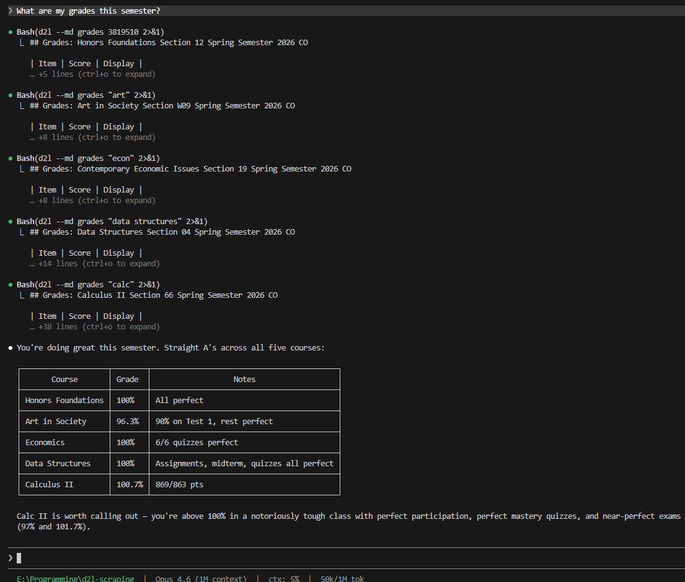
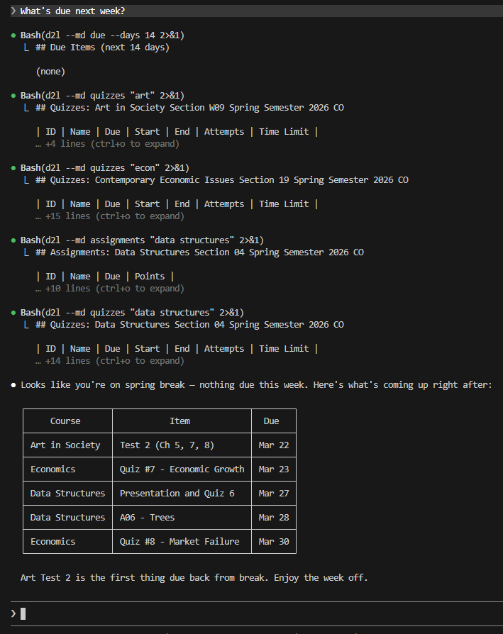

# d2l-cli

Read-only CLI for D2L Brightspace. Pulls grades, assignments, content, syllabi, and more — designed to be used by AI coding agents (Claude Code, OpenClaw, etc.) as a tool.

> **AI agents:** See [AGENTS.md](AGENTS.md) for the full command reference, or [QUICKSTART.md](QUICKSTART.md) for setup.

## Example Usage

Ask your AI agent a natural question — it calls `d2l` under the hood and gives you a clean summary.

> *"What are my grades this semester?"*



> *"What's due next week?"*



## Setup

```bash
git clone https://github.com/Aaryan-Kapoor/d2l-cli.git
cd d2l-cli
python -m venv .venv
source .venv/bin/activate        # Linux/Mac
source .venv/Scripts/activate    # Windows (Git Bash)
pip install -e .
```

For browser-based token capture (optional):
```bash
pip install -e ".[login]"
playwright install chromium
```

## Configuration

Edit `src/d2l/config.py` with your institution's details:

```python
LMS_HOST = "https://your-school.view.usg.edu"     # your Brightspace URL
TENANT_ID = "your-tenant-id-here"                  # from browser network tab
```

For SimpleSyllabus integration, edit `src/d2l/commands/syllabus.py`:
```python
SYLLABUS_SEARCH_URL = "https://your-school.simplesyllabus.com/api2/syllabus-search"
SYLLABUS_FULL_URL = "https://your-school.simplesyllabus.com/api2/doc-full-page-get"
```

## Authentication

D2L uses a Bearer token (JWT) that expires every ~1 hour.

**Option A — Browser capture (recommended):**
```bash
d2l login                 # opens browser, captures token automatically
d2l login --headless      # headless mode (reuses saved session cookies)
```

**Option B — Manual:**
1. Open DevTools (F12) on your D2L site
2. Network tab → find any request to `*.api.brightspace.com`
3. Copy the `Authorization: Bearer ...` token
4. Save to `~/.d2l/token.json`:
```json
{
  "token": "eyJ...",
  "exp": 1773515217,
  "sub": "your-user-id",
  "tenant": "your-tenant-id",
  "captured_at": 1773511617
}
```

Check token status:
```bash
d2l token
```

## Commands

```
d2l [--json | --md] <command>

Identity:
  login [--headless]              Browser-based token capture
  token                           Token status (no API call)
  whoami                          Current user info

Courses:
  courses [--all]                 List enrolled courses

Academics:
  grades COURSE [--final]         Grades for a course or across all
  assignments COURSE              Assignments + due dates
  quizzes COURSE                  Quiz list + dates
  syllabus COURSE                 Full syllabus from SimpleSyllabus

Content:
  content COURSE [--toc]          Course modules and topics
  discussions COURSE              Forums, topics, posts
  news [COURSE] [--since DATE]    Announcements

Scheduling:
  calendar [--course X] [--days N]  Calendar events
  due [--days N]                    Items due soon
  overdue                           Overdue items
  updates [COURSE]                  Unread update counts

Downloads:
  download COURSE ASSIGNMENT [-o DIR]          Assignment attachments
  download-content COURSE MODULE [-o DIR]      Content files (notes, slides)

AI Snapshot:
  dump [--course X] [--shallow] [--since N] [--include TYPE]
```

All COURSE arguments accept fuzzy names (`"data structures"`), course codes, or numeric org unit IDs.

## Output Formats

- Default: human-readable aligned tables
- `--json`: structured JSON for programmatic use
- `--md`: AI-optimized markdown (full text, IDs, ISO dates)

```bash
d2l grades "calc"                  # human table
d2l --json grades "calc"           # JSON
d2l --md grades "calc"             # markdown
```

## AI Agent Integration

### Claude Code / OpenClaw

`AGENTS.md` at the repo root is the universal agent instruction file — automatically read by Claude Code, Copilot, Codex, Cursor, Windsurf, Gemini CLI, Aider, and others.

**Setup steps:**

1. Install `d2l-cli` in the agent's environment:
   ```bash
   cd /path/to/d2l-cli
   pip install -e .
   ```

2. Capture a token:
   ```bash
   d2l login
   ```

3. Point your agent to this repo (or copy `AGENTS.md` to your project root). For Claude Code specifically, the `.claude/skills/d2l/SKILL.md` is also included.

4. The agent can now run `d2l` commands. Example prompts:
   - *"What's due this week?"*
   - *"How am I doing in data structures?"*
   - *"Download the starter code for assignment 6"*
   - *"What's the grading breakdown for calc?"*

### Other Agents (MCP, custom)

The `--json` flag makes every command machine-readable:

```bash
# Full academic snapshot as JSON
d2l --json dump

# Grades for one course
d2l --json grades "data structures"

# What's new in the last 24 hours
d2l --json dump --since 24
```

### Headless Server Setup

For agents running on a headless server (no GUI):

1. Run `d2l login` on a machine with a browser (captures token + browser profile)
2. Copy `~/.d2l/` to the server
3. Set up a cron job to refresh the token (session cookies last days/weeks):
   ```bash
   # Refresh token every 45 minutes using saved session cookies
   */45 * * * * cd /path/to/d2l-cli && .venv/bin/d2l login --headless
   ```

## Key Commands for Agents

```bash
# Quick overview
d2l --md dump --shallow

# What's new since last check
d2l --md dump --since 24

# Full context for one course
d2l --md dump --course "data structures"

# Get syllabus (grading weights, policies)
d2l --md syllabus "data structures"

# Download assignment starter files
d2l download "data structures" "trees" -o ./assignment

# Download lecture notes
d2l download-content "calc" "Unit 3 Materials" -o ./notes
```

## KSU Quick Start

If you're at Kennesaw State University, no configuration needed — it works out of the box.

```bash
git clone https://github.com/Aaryan-Kapoor/d2l-cli.git
cd d2l-cli
python -m venv .venv
source .venv/Scripts/activate    # or source .venv/bin/activate on Linux/Mac
pip install -e ".[login]"
playwright install chromium

# Log in (opens browser, captures token automatically via KSU SSO)
d2l login

# See your courses
d2l courses

# Check grades
d2l grades "data structures"

# What's due?
d2l due

# What's overdue?
d2l overdue

# Get the syllabus for any course
d2l syllabus "calc"

# Download assignment starter code
d2l download "data structures" "A06" -o ./trees-assignment

# Download lecture notes
d2l download-content "calc" "Exam Preparation" -o ./exam-prep

# Full snapshot for AI assistants
d2l --md dump
```

KSU's SimpleSyllabus integration is built in — `d2l syllabus` fetches directly from `kennesaw.simplesyllabus.com` (no auth required).

Token expires every ~1 hour. Just run `d2l login` again — your SSO session cookies persist so it's instant (no re-login).

## Strictly Read-Only

This tool only performs GET requests. It cannot submit assignments, post discussions, modify grades, or change anything on D2L. By design.
