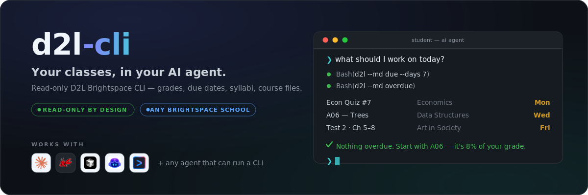

<p align="center">
  
</p>

<p align="center">
  
  
  
  
</p>

# d2l-cli

Read-only CLI for D2L Brightspace. Pulls grades, assignments, content, syllabi, and more — designed to be used by AI coding agents (Claude Code, OpenClaw, etc.) as a tool. Works with any school on Brightspace; Kennesaw State and Georgia State ship as one-word presets.

> **AI agents:** See [INSTALL_FOR_AGENTS.md](INSTALL_FOR_AGENTS.md) for end-to-end setup, [AGENTS.md](AGENTS.md) for the full command reference, or [QUICKSTART.md](QUICKSTART.md) for short setup.

## Set Up With Your Agent (recommended)

Send this to your AI agent:

```text
Fetch and follow the instructions from https://raw.githubusercontent.com/Aaryan-Kapoor/d2l-cli/main/INSTALL_FOR_AGENTS.md
```

The agent installs the CLI, asks which school you attend, configures it with `d2l setup`, installs the bundled agent skill into its own skill system, walks you through browser login when needed, verifies access with `d2l doctor`, and runs course onboarding to create `D2L_COURSE_SOP.md`. Your only jobs: tell it your school, and complete your normal SSO login when a browser window opens.

## Example Usage

Ask your AI agent a natural question — it calls `d2l` under the hood and gives you a clean summary.

> *"What are my grades this semester?"*


> *"What's due next week?"*


## Manual Setup

Three commands — no clone, no venv, no config files to edit:

```bash
pipx install "d2l-cli[login] @ git+https://github.com/Aaryan-Kapoor/d2l-cli.git"
d2l setup       # pick your school
d2l login       # browser opens — log in like normal, token captured automatically
```

No pipx? `python -m pip install --user "d2l-cli[login] @ git+https://github.com/Aaryan-Kapoor/d2l-cli.git"` works too (make sure `$(python -m site --user-base)/bin` is on your PATH).

## Configuration

`d2l setup` stores your school in `~/.d2l/config.json`:

```bash
d2l setup                        # interactive school picker
d2l setup --school ksu           # Kennesaw State preset
d2l setup --school gsu           # Georgia State preset
d2l setup --host https://your-school.view.usg.edu   # any Brightspace school
d2l setup --syllabus-host https://your-school.simplesyllabus.com   # optional
d2l setup --show                 # current config
```

Per-run overrides: `D2L_HOST` and `D2L_SYLLABUS_HOST` environment variables.

## Authentication

D2L uses a Bearer token (JWT) that expires every ~1 hour.

```bash
d2l login                 # opens browser, captures token automatically
d2l login --headless      # headless mode (reuses saved session cookies)
d2l token                 # check token status
```

`d2l login` uses Playwright's bundled Chromium if installed, and automatically falls back to your installed Chrome or Edge — so `playwright install chromium` is optional on most machines. Pin one with `--channel chrome|msedge|chromium`.

## Commands

```
d2l [--json | --md] <command>

Setup:
  setup [--school NAME | --host URL]   Configure your school (stored in ~/.d2l/config.json)
  doctor                               Diagnose config/auth/API state + next step
  skill install DIR                    Install the bundled agent skill
  update [--ref REF]                   Update to the latest release from GitHub

Identity:
  login [--headless] [--channel X]     Browser-based token capture
  token                                Token status (no API call)
  whoami                               Current user info

Courses:
  courses [--all]                 List enrolled courses

Academics:
  grades COURSE [--final]         Grades for a course or across all
  assignments COURSE              Assignments + due dates
  quizzes COURSE                  Quiz list + dates
  syllabus COURSE                 Full syllabus from SimpleSyllabus

Content:
  content COURSE [--toc]          Course modules and topics
  discussions COURSE              Forums, topics, posts
  news [COURSE] [--since DATE]    Announcements

Scheduling:
  calendar [--course X] [--days N]  Calendar events
  due [--days N]                    Items due soon
  overdue                           Overdue items
  updates [COURSE]                  Unread update counts

Downloads:
  download COURSE ASSIGNMENT [-o DIR]          Assignment attachments
  download-content COURSE MODULE [-o DIR]      Content files (notes, slides)

AI Snapshot:
  dump [--course X] [--shallow] [--since N] [--include TYPE]

Onboarding:
  onboard [--output FILE] [--force] [--yes]  Create/update course SOP + onboarding state
```

All COURSE arguments accept fuzzy names (`"data structures"`), course codes, or numeric org unit IDs.

## Output Formats

- Default: human-readable aligned tables
- `--json`: structured JSON for programmatic use
- `--md`: AI-optimized markdown (full text, IDs, ISO dates)

```bash
d2l grades "calc"                  # human table
d2l --json grades "calc"           # JSON
d2l --md grades "calc"             # markdown
```

## AI Agent Integration

### Claude Code / OpenClaw

`AGENTS.md` at the repo root is the universal agent instruction file — automatically read by Claude Code, Copilot, Codex, Cursor, Windsurf, Gemini CLI, Aider, and others.

**Setup steps:**

1. Install `d2l-cli` onto the user's PATH:
   ```bash
   python -m pip install --user "d2l-cli[login] @ git+https://github.com/Aaryan-Kapoor/d2l-cli.git"
   export PATH="$(python -m site --user-base)/bin:$PATH"
   d2l --version
   ```

2. Ask the user which school they attend, then configure it:
   ```bash
   d2l setup --school ksu          # or gsu, or --host <their Brightspace URL>
   ```

3. Capture a token:
   ```bash
   d2l login
   ```

   If a saved token expires later, agents should try `d2l login --headless` first. If that fails, ask the user before launching `d2l login` for interactive browser login. Browser login is only for authentication; do not scrape course data through the browser.

4. Install the bundled skill into the agent's skill system and run onboarding:
   ```bash
   d2l skill install ~/.claude/skills/d2l    # or the agent system's skill dir
   d2l onboard
   ```

   Onboarding writes `D2L_COURSE_SOP.md` and `.d2l/onboarding.json`. The state file stores a fingerprint of active courses, so agents can detect that onboarding is already complete and avoid repeating the setup interview unless courses change.

5. At any point, `d2l --json doctor` reports every setup check with the exact next command to run.

6. The agent can now run `d2l` commands. Example prompts:
   - *"What's due this week?"*
   - *"How am I doing in data structures?"*
   - *"Download the starter code for assignment 6"*
   - *"What's the grading breakdown for calc?"*

### Other Agents (MCP, custom)

The `--json` flag makes every command machine-readable:

```bash
# Full academic snapshot as JSON
d2l --json dump

# Grades for one course
d2l --json grades "data structures"

# What's new in the last 24 hours
d2l --json dump --since 24
```

### Headless Server Setup

For agents running on a headless server (no GUI):

1. Run `d2l login` on a machine with a browser (captures token + browser profile)
2. Copy `~/.d2l/` to the server
3. Set up a cron job to refresh the token (session cookies last days/weeks):
   ```bash
   # Refresh token every 45 minutes using saved session cookies
   */45 * * * * d2l login --headless
   ```

## Key Commands for Agents

```bash
# Quick overview
d2l --md dump --shallow

# What's new since last check
d2l --md dump --since 24

# Full context for one course
d2l --md dump --course "data structures"

# Get syllabus (grading weights, policies)
d2l --md syllabus "data structures"

# Download assignment starter files
d2l download "data structures" "trees" -o ./assignment

# Download lecture notes
d2l download-content "calc" "Unit 3 Materials" -o ./notes

# First-time course SOP setup
d2l onboard
```

## Student Quick Start

```bash
pipx install "d2l-cli[login] @ git+https://github.com/Aaryan-Kapoor/d2l-cli.git"

# Pick your school (KSU and GSU are presets; any Brightspace URL works)
d2l setup

# Log in (opens browser, captures token automatically via your school's SSO)
d2l login

# See your courses
d2l courses

# Check grades
d2l grades "data structures"

# What's due?
d2l due

# What's overdue?
d2l overdue

# Get the syllabus for any course
d2l syllabus "calc"

# Download assignment starter code
d2l download "data structures" "A06" -o ./trees-assignment

# Download lecture notes
d2l download-content "calc" "Exam Preparation" -o ./exam-prep

# Full snapshot for AI assistants
d2l --md dump
```

`d2l syllabus` uses SimpleSyllabus (no auth required). The KSU preset configures it automatically; other schools can add theirs with `d2l setup --syllabus-host`.

Token expires every ~1 hour. Just run `d2l login` again — your SSO session cookies persist so it's instant (no re-login).

## Strictly Read-Only

Course-data commands are read-only. The CLI cannot submit assignments, post discussions, modify grades, or change anything on D2L. By design.

## Disclaimer

This is a personal project and is not affiliated with, endorsed by, or associated with D2L, Brightspace, or Kennesaw State University in any way. Just something I built for myself and thought was worth sharing.
